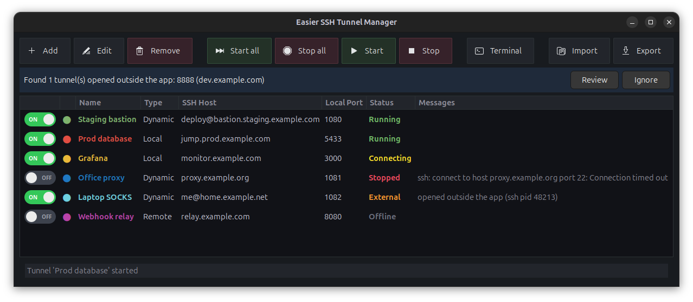
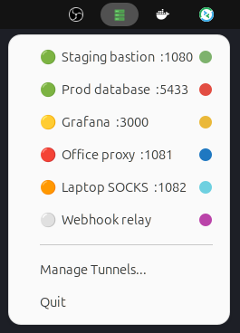
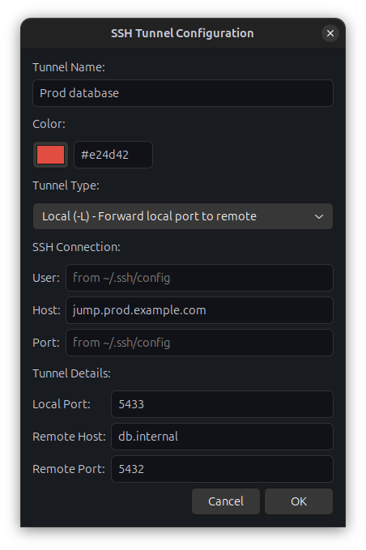

# Easy SSH Tunnel Manager


**A simple, user-friendly GUI application for managing SSH tunnels on Linux.** Easy SSH Tunnel Manager lets you create, configure, and monitor local, remote, and dynamic SSH tunnels through an intuitive interface with system tray integration.

[](https://opensource.org/licenses/MIT)
[](https://www.python.org/downloads/)
[](https://www.gtk.org/)

---

## Screenshots

### Main Window


*The main interface showing all configured SSH tunnels with their status*

### System Tray Integration


*Quick access to tunnels from the system tray with status indicators*

### Add/Edit Tunnel Dialog


*Easy-to-use dialog for configuring SSH tunnels*

---

## Features

- **System Tray Integration:**
  - Icon appears in the top bar (system tray)
  - Left-click: Quick menu showing all tunnels with status indicators
  - Click on tunnel name to toggle it on/off
  - Each tunnel shows its status (🟢 running, 🟡 connecting, 🔴 stopped, ⚪ offline) and local port
  - "Manage Tunnels..." option to open the full configuration GUI

- **Multiple Tunnel Types:**
  - Local port forwarding (`-L`): Forward a local port to a remote destination
  - Remote port forwarding (`-R`): Forward a remote port to a local destination
  - Dynamic port forwarding (`-D`): Create a SOCKS proxy

- **Easy Management:**
  - Add, edit, and remove tunnel configurations
  - Start and stop tunnels with the ON/OFF switch on each row, by double-clicking a row, or with the toolbar buttons
  - Start all or stop all tunnels at once
  - View tunnel status in real-time, with the last ssh error (for example a port that is already in use) in the Messages column
  - Open an interactive ssh session to a tunnel's host in the default terminal
  - Detect tunnels opened outside the app (a plain `ssh -D/-L` in a terminal, or a forward on a shared ControlMaster connection) and add them to the list
  - Persistent configuration storage

- **User-Friendly Interface:**
  - Dark GTK3 interface
  - A color per tunnel, picked or entered as hex, shown in the list and as a dot in the tray menu
  - Simple dialog for configuring tunnels
  - Real-time status indicators

## Requirements

- Python 3.6+
- GTK3
- PyGObject
- AppIndicator3
- OpenSSH client

## Installation

### Quick Setup (Ubuntu/Debian)

```bash
# Clone the repository
git clone https://github.com/ProjectMakersDE/EasySSHTunnelManager.git
cd EasySSHTunnelManager

# Install system dependencies
sudo apt-get update
sudo apt-get install python3 python3-gi python3-gi-cairo gir1.2-gtk-3.0 gir1.2-appindicator3-0.1
# Ubuntu 24.04 ships the Ayatana fork instead; the app uses it when AppIndicator3 is missing:
# sudo apt-get install gir1.2-ayatanaappindicator3-0.1

# Make the script executable
chmod +x easy_ssh_tunnel.py

# Run the application
./easy_ssh_tunnel.py
```

The application will start in system tray mode. Look for the network server icon in your top bar!

### System-Wide Installation (Optional)

For system-wide installation and desktop menu integration:

```bash
cd EasySSHTunnelManager
sudo ./install.sh
```

This will:
- Install all required dependencies
- Copy the script to `/usr/local/bin/`
- Create a desktop entry for the applications menu
- Enable the application to run from anywhere with `easy_ssh_tunnel.py`

After installation, you can launch it from the Gnome applications menu or add it to startup applications.

### Updating to Latest Version

If you're updating from a previous version:

```bash
cd EasySSHTunnelManager

# Pull latest changes (if using git)
git pull

# Install any new dependencies (especially AppIndicator3 for system tray)
sudo apt-get install gir1.2-appindicator3-0.1

# Make executable
chmod +x easy_ssh_tunnel.py

# Test the application
./easy_ssh_tunnel.py
```

Your existing tunnel configurations in `~/.config/easy-ssh-tunnel/tunnels.json` will be preserved.

### On other Linux distributions

Install the equivalent packages for your distribution:
- Python 3.6+
- GTK3 GObject introspection bindings
- AppIndicator3 GObject introspection bindings (for system tray support)

## Usage

### Running the Application

**With System Tray (default):**
```bash
./easy_ssh_tunnel.py
```

The application will start minimized to the system tray. Look for the network icon in the top bar.

**Without System Tray (window only):**
```bash
./easy_ssh_tunnel.py --no-indicator
```

### Using the System Tray

1. **Click the icon** in the top bar to open the quick menu
2. You'll see all configured tunnels with status indicators:
   - 🟢 = running, the local port is open
   - 🟡 = connecting, ssh is running but the port is not open yet
   - 🟠 = external, the port is held by an ssh process outside the app
   - 🔴 = stopped, the tunnel was switched on but the connection went down
   - ⚪ = offline, the tunnel is switched off
3. **Click on a tunnel name** to toggle it on/off
4. **Click "Manage Tunnels..."** to open the full configuration window
5. **Click "Quit"** to exit the application

### Managing Tunnels

1. Click **"Manage Tunnels..."** from the tray menu or run with `--no-indicator`
2. Use the toolbar buttons:
   - **Add** - Create a new tunnel configuration
   - **Edit** - Modify an existing tunnel
   - **Remove** - Delete a tunnel configuration
   - **Start all** / **Stop all** - Start every tunnel that is not open, or stop every tunnel started by the app
   - **Start** - Activate a tunnel
   - **Stop** - Deactivate a tunnel; on a stopped tunnel this clears it to offline
   - **Terminal** - Open `ssh [user@]host` in the default terminal (`x-terminal-emulator`)
3. The switch at the start of each row shows whether the tunnel's port is open and follows the connection: it turns off when ssh exits.
4. **Quit** (tray menu, or closing the window with `--no-indicator`) stops every tunnel the app started. When tunnels are running, the app asks first.

### Tunnel Status

| Status | Meaning |
|---|---|
| Running | ssh runs and the local port is open |
| Connecting | ssh runs, the local port is not open yet |
| Stopped | the tunnel was switched on, but ssh exited; the Messages column shows why |
| External | the tunnel's port is held by an ssh process outside the app |
| Offline | the tunnel is switched off |

### Tunnels Opened Outside the App

Every 5 seconds the app looks for local ports held by `ssh` processes it did not start. New ones appear in a bar above the list: **Review** opens a dialog to add them, **Ignore** hides them. A tunnel in the list whose port is held this way shows as **External**. Stopping it asks first, then ends that ssh process, or for a forward on a shared ControlMaster connection runs `ssh -O cancel`.

### Adding a Tunnel

1. Click the **Add** button in the toolbar
2. Fill in the tunnel configuration:
   - **Tunnel Name**: A descriptive name for this tunnel
   - **Color**: Pick a color or type a hex value like `#7eb26d`
   - **Tunnel Type**: Choose Local, Remote, or Dynamic
   - **SSH Connection**: User, host, and port for the SSH server. Leave User and Port empty to take them from `~/.ssh/config`; a `Host` alias from that file works as host.
   - **Tunnel Details**: Port forwarding configuration
3. Click **OK** to save

### Tunnel Types Explained

#### Local Port Forwarding (-L)
Forward a local port to a remote destination through the SSH server.

Example: Access a database on a remote network
- Local Port: 3306
- Remote Host: database.internal.example.com
- Remote Port: 3306

After starting, connect to `localhost:3306` to access the remote database.

#### Remote Port Forwarding (-R)
Forward a remote port on the SSH server to a local destination.

Example: Share a local web server with others through the SSH server
- Local Port: 8080
- Remote Host: localhost
- Remote Port: 9090

After starting, others can access your local web server at `ssh-server:9090`.

#### Dynamic Port Forwarding (-D)
Create a SOCKS proxy for dynamic traffic routing.

Example: Route browser traffic through the SSH server
- SOCKS Port: 1080

Configure your browser to use `localhost:1080` as a SOCKS5 proxy.

## Configuration

Tunnel configurations are stored in:
```
~/.config/easy-ssh-tunnel/tunnels.json
```

You can manually edit this file if needed, but it's recommended to use the GUI.

## SSH Key Authentication

This application uses the system SSH client and your `~/.ssh/config`, so it supports all SSH authentication methods configured on your system:
- Password authentication (will prompt when starting tunnel)
- SSH key authentication (recommended)

For passwordless operation, set up SSH key authentication:

```bash
# Generate SSH key if you don't have one
ssh-keygen -t ed25519

# Copy your public key to the remote server
ssh-copy-id user@remote-server
```

Each tunnel opens its own SSH connection (`-o ControlMaster=no -o ControlPath=none`). With connection sharing enabled in `~/.ssh/config`, a forward would otherwise be added to an already open master connection and stay open after the tunnel is stopped. `ExitOnForwardFailure=yes` makes a tunnel exit when its port cannot be bound, so it does not show as running without a working forward.

## Autostart on Login

`sudo ./install.sh` asks whether to start the application at login and, when you answer yes, installs `~/.config/autostart/easy-ssh-tunnel.desktop` for the user who ran sudo. Tunnels are not started automatically.

To set it up by hand instead:

1. Open "Startup Applications" in Gnome
2. Click "Add"
3. Fill in:
   - **Name**: Easy SSH Tunnel Manager
   - **Command**: `/usr/local/bin/easy_ssh_tunnel.py` (or full path to the script)
   - **Comment**: Manage SSH tunnels from system tray
4. Click "Add"

The application will now start in the system tray on login.

## Troubleshooting

### Tunnel won't start
- Check that you can SSH to the server manually: `ssh user@host`
- Verify the ports are not already in use; the Messages column names the process that holds the port
- Check SSH server configuration allows port forwarding

### Permission denied
- Ensure you have SSH access to the remote server
- Set up SSH key authentication to avoid password prompts

### Tunnel shows as "Running" but doesn't work
- Check if the SSH process is actually running: `ps aux | grep ssh`
- Verify firewall settings on both local and remote systems
- Check SSH server logs for errors

### System tray icon doesn't appear
- Make sure AppIndicator3 is installed: `sudo apt-get install gir1.2-appindicator3-0.1`, or on Ubuntu 24.04 `gir1.2-ayatanaappindicator3-0.1`
- Some Gnome versions may need the "AppIndicator Support" or "Ubuntu AppIndicators" extension
- Check if your desktop environment supports system tray/AppIndicator
- Try running with `--no-indicator` flag to use window mode as fallback

### AppIndicator3 import error
If you get an error about AppIndicator3:
```bash
sudo apt-get install gir1.2-appindicator3-0.1
```

The application will automatically fall back to window mode if AppIndicator3 is not available.

## Contributing

Contributions are welcome! Please feel free to submit a Pull Request. For major changes, please open an issue first to discuss what you would like to change.

### How to Contribute

1. Fork the repository
2. Create your feature branch (`git checkout -b feature/AmazingFeature`)
3. Commit your changes (`git commit -m 'Add some AmazingFeature'`)
4. Push to the branch (`git push origin feature/AmazingFeature`)
5. Open a Pull Request

## License

This project is licensed under the MIT License - see the [LICENSE](LICENSE) file for details.

## Support

If you find this project useful, please consider:
- Giving it a star on GitHub
- Reporting bugs and suggesting features via [GitHub Issues](../../issues)
- Contributing code or documentation improvements


## Acknowledgments

- Built with [GTK3](https://www.gtk.org/) and [PyGObject](https://pygobject.readthedocs.io/)
- System tray integration powered by [AppIndicator3](https://lazka.github.io/pgi-docs/#AppIndicator3-0.1)
- Inspired by the need for a simple, user-friendly SSH tunnel manager on Linux
